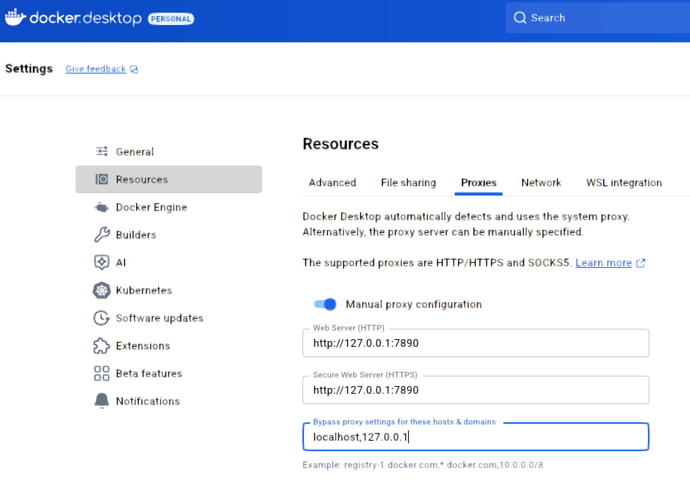
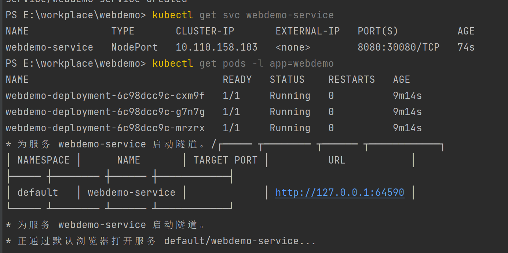

DockerDesktop使用了代理

# 命令
部署deployments和创建service后
minikube service webdemo-service 获取url后访问服务（因为本机和k8s集群网络是不通的）

minikube service webdemo-service命令实际上做了以下几件事：
在后台创建了一个临时隧道，将你的本地机器连接到 Kubernetes 集群中的 Service 做了一个映射

## docker相关
构建语句 docker build -t webdemo:v1.0 .
-t 是打tag的意思 .是当前目录
运行语句 docker run -d -p 8080:8080 --name webdemo webdemo:v1.0
-d：--detach的缩写，表示 “后台运行容器”  如果不加-d，容器会在当前终端前台运行，关闭终端则容器停止。

## minikube
minikube start
minikube stop

加载镜像 minikube image load webdemo:v1.0
获取访问地址 minikube service webdemo-service --url
进入节点 minikube ssh -n minikube-m02

## k8s
查看pods kubectl get pods -o wide
查看deployments kubectl get deployments
查看services kubectl get services

部署 kubectl apply -f webdemo-deployment.yaml
创建service kubectl apply -f webdemo-service.yaml

#k8s删除 Deployment 后，它所管理的所有 Pod 会被自动终止并删除： kubectl delete deployment webdemo-deployment
#k8s删除service：kubectl delete service webdemo-service

## nacos
单机启动（无MySql）:docker run -d --name nacos-server -p 8848:8848 -p 9848:9848 -p 9849:9849 -e MODE=standalone nacos/nacos-server:v2.3.0
Nacos 2.x 相比 1.x 增加了 gRPC 协议用于客户端与服务器的通信，需要开放两个额外端口：
9848：客户端 gRPC 通信端口（主端口 8848 + 1000）
9849：服务端间 gRPC 通信端口（主端口 8848 + 1001）
如果这些端口未开放或被占用，会导致服务注册失败并提示端口不可用。
# 知识
## 为什么一个node上两个相同的pods端口不会冲突
Kubernetes 中，每个 Pod 会被分配一个 唯一的集群内部 IP 地址（比如 10.244.1.5、10.244.1.6），且每个 Pod 的网络环境是完全隔离的：
Pod A（IP: 10.244.1.5）的容器监听 8080 端口，对外暴露的是 10.244.1.5:8080；
Pod B（IP: 10.244.1.6）的容器也监听 8080 端口，对外暴露的是 10.244.1.6:8080。
这就像 “两台独立的电脑”：即使都用 8080 端口，因为 IP 地址不同（一台是 192.168.1.10，另一台是 192.168.1.11）
彼此的 8080 端口也不会冲突 ——Node 上的两个 Pod 就是这个逻辑，它们的 8080 端口属于不同的 “网络身份”（IP + 端口），互不干扰。

## 
创建service后，访问service即可实现负载均衡

todo
#todo 现在应该固定service的外部访问方式了 生产是用云环境使用 LoadBalancer 类型服务（推荐）
#测试用minikube service webdemo-service 要了解下生产的方案 和Ingress的关系

四、云环境的 “主流架构”：Ingress + LoadBalancer 配合使用
在生产环境中，纯 LoadBalancer 或纯 Ingress 都较少见，更多是 “Ingress 作为七层入口，云 LoadBalancer 作为 Ingress 的四层入口”，形成 “分层负载均衡” 架构：

配置管理：K8s 管基础设施配置，Nacos 管业务配置，避免权责混乱

## rpc
RPC 的全称是 Remote Procedure Call（远程过程调用）。
它是一种计算机通信协议，允许一台计算机（客户端）通过网络调用另一台计算机（服务器）上的程序或函数，而无需了解底层网络技术的细节。简单来说，就是 “像调用本地方法一样调用远程服务器上的方法”。
RPC 屏蔽了网络通信的复杂性（如数据传输、序列化 / 反序列化、网络协议等），让开发者可以专注于业务逻辑，是分布式系统和微服务架构中服务间通信的核心技术之一（常见的 RPC 框架有 Dubbo、gRPC、Thrift 等）。e